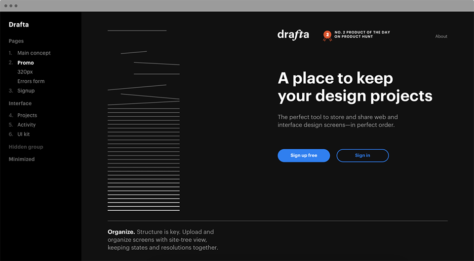
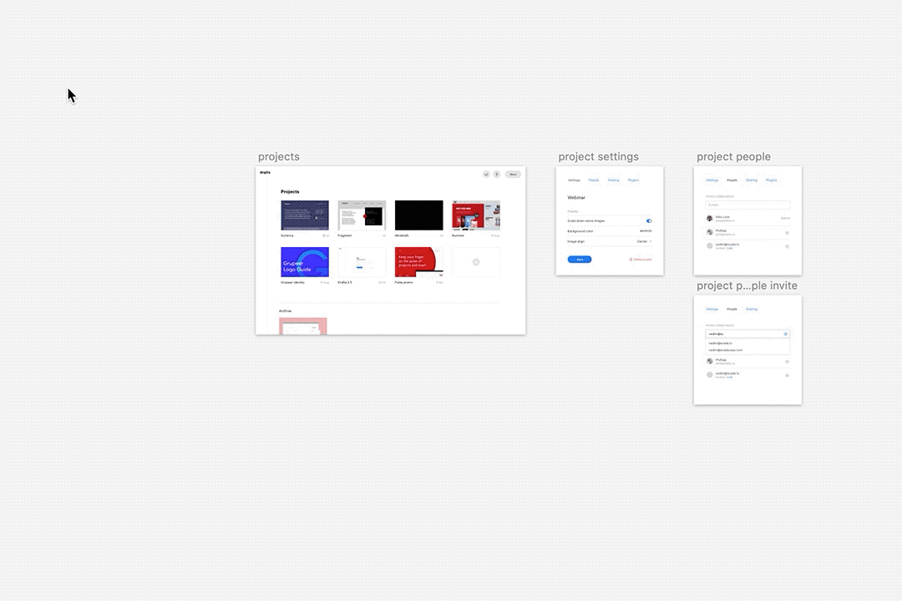

# Drafta

Drafta is a tool to keep track of project design screens and share them with others. It is a team-oriented service with one-click access to every project, with up-to-date design screens. A sidebar features page names, serving as the sitemap. It makes easy to navigate between screens, especially when you are working on a project with 70+ pages in different stages of completion. 

[Download zip](https://github.com/fragmentlv/drafta/releases/download/v1.0.5/drafta-export.sketchplugin.zip)

http://drafta.co
